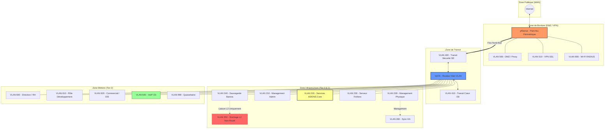

## 1. Découpage en zones et Segmentation (VLANs)

L'infrastructure d'EcoTech Solutions adopte une architecture hiérarchisée "Enterprise" conçue pour la performance et la sécurité. Le routage est distribué sur trois niveaux pour éviter les goulots d'étranglement et les points de défaillance uniques (SPOF).

### 1.1. Architecture Hiérarchisée à 3 Niveaux

1. **Niveau Sécurité (Edge/Périmètre) — pfSense** : Gère la frontière avec l'Internet (WAN), l'isolation de la **DMZ**, le Wi-Fi invités et les terminaisons VPN. Il assure l'inspection profonde des paquets (DPI/IPS).
2. **Niveau Routage (Backbone) — Routeur Dédié** : Assure l'aiguillage du trafic entre le périmètre et le cœur de réseau via des réseaux de transit. Il gère la table de routage globale.
3. **Niveau Distribution (Core) — Switch L3** : Porte les passerelles (SVI) de tous les VLANs internes. Il assure le routage inter-VLAN à vitesse filaire pour les 251 collaborateurs et les serveurs de production.

### 1.2. Classification des Zones de Confiance

Conformément aux recommandations de l'ANSSI, l'infrastructure est segmentée en niveaux de criticité. Chaque zone est associée à un **Code de Confiance** utilisé pour le marquage des flux et l'obfuscation technique :

| **Zone (Code)** | **Niveau de Confiance**   | **Description et Politique**                                                                   |
| --------------- | ------------------------- | ---------------------------------------------------------------------------------------------- |
| **INFRA (P)**   | **Principal (Tier 0)**    | **Critique.** Cœur du système (Hyperviseurs, Stockage). Accès internet strictement interdit.   |
| **ADMIN (S)**   | **Secondaire (Tier 1)**   | **Très Haute.** Administration et identités (AD). Flux entrants très filtrés.                  |
| **USER (U)**    | **Utilisateur (Tier 2)**  | **Moyenne.** Postes de travail fixes (Bureaux). Accès aux ressources limité aux ports métiers. |
| **MOBILE (W)**  | **Workstations (Mobile)** | **Contrôlée.** Flotte mobile et terminaux sans fil entreprise. Accès restreint (Web/Mail).     |
| **SERVICE (R)** | **Ressources**            | **Faible.** Périphériques passifs (Imprimantes, VoIP). Communication entrante interdite.       |
| **EDGE (E)**    | **Exposé**                | **Nulle.** Zone de front (DMZ, Wi-Fi Invités) soumise à inspection DPI.                        |
| **TRANSIT (A)** | **Area**                  | **Technique.** Réseaux d'interconnexion point-à-point. Aucun hôte final.                       |

### 1.3. Tableau détaillé de la segmentation (15 VLANs)

Cette structure permet une gestion granulaire des flux sur le pare-feu pfSense.

| Catégorie    | ID      | Nom          | **Usage / Population**            | Zone de Confiance      |
| ------------ | ------- | ------------ | --------------------------------- | ---------------------- |
| **INFRA**    | **200** | **VLAN_200** | Management Physique (Tier 0)      | **P** (Tier 0)         |
| _(+10)_      | **210** | **VLAN_210** | Postes Administrateurs (Tier 1)   | **S** (Tier 1)         |
|              | **220** | **VLAN_220** | Services Core (AD, DNS, DHCP)     | **S** (Services Core)  |
|              | **230** | **VLAN_230** | **Serveur de Fichiers (Données)** | **S** (Fichiers)       |
|              | **240** | **VLAN_240** | Serveur Sauvegarde (Bareos)       | **S** (Bareos)         |
|              | **250** | **VLAN_250** | Stockage Isolé (NFS / iSCSI)      | **P** (Stockage L2)    |
| **METIERS**  | **600** | **VLAN_600** | Direction                         | **U** (Direction)      |
| _(+10)_      | **610** | **VLAN_610** | Services IT, DSI                  | **U** (DSI)            |
|              | **620** | **VLAN_620** | Direction des Ressources Humaines | **U** (DRH)            |
|              | **630** | **VLAN_630** | Service Commercial                | **U** (Commercial)     |
|              | **640** | **VLAN_640** | Finance et Comptabilité           | **U** (Finance/Compta) |
|              | **650** | VLAN_650     | Communication                     | **U** (Communication)  |
|              | **660** | VLAN_660     | Développement                     | **U** (Développement)  |
|              | **670** | VLAN_670     | Service téléphonique              | **R** (VoIP)           |
| **MOBILITE** | **800** | **VLAN_800** | **WiFi (802.1X / RADIUS)**        | **W** (WiFi RADIUS)    |
| **SECURITE** | **999** | **VLAN_999** | **Quarantaine**                   | **S** (Quarantaine)    |

### 1.4. Zoom sur les Spécificités d'Architecture

#### A. Justification de l'optimisation par Tiers

L'infrastructure applique le modèle de segmentation par "Tiers" pour empêcher la compromission totale du réseau en cas d'intrusion sur un poste utilisateur.

- **Isolation du Cœur (Tier 0 — VLAN 200 & 250)** : Regroupe le management de l'hyperviseur et le stockage. Ces segments sont totalement isolés ; aucune route n'existe depuis les zones utilisateurs (**U**) ou mobiles (**W**).
- **Administration et Identité (Tier 1 — VLAN 210 & 220)** : L'administration ne s'effectue jamais depuis un poste standard. Les administrateurs utilisent des machines dédiées dans le **VLAN 210** pour piloter les services d'identité (**AD/DNS/DHCP**) situés dans le **VLAN 220**.
- **Micro-segmentation des données (VLAN 230 & 240)** : Le serveur de fichiers (**230**) est séparé des services d'identité et de la sauvegarde (**240**). Cette étanchéité limite la propagation latérale de malwares de type Ransomware.

#### B. Isolation spécifique de la DMZ

Conformément au schéma, la **DMZ** est rattachée directement au **pfSense**.

- **Étanchéité** : Aucun flux provenant de la DMZ ne peut atteindre le Cœur de réseau sans une inspection explicite (IPS/IDS).
- **Relais de Services** : Le serveur Proxy en DMZ sert de point de passage unique pour les mises à jour, évitant d'exposer les serveurs critiques (Tier 1) directement à l'Internet.

#### C. Réseaux de Sécurité L2 (240 & 250)

Ces réseaux sont dits "non-routés" car ils ne possèdent pas de passerelle par défaut.

- **VLAN 250 (Stockage Isolé)** : Utilise les protocoles iSCSI/NFS pour relier le serveur **Bareos (240)** à son stockage physique. Étant non-routé, ce segment est physiquement inaccessible depuis le Wi-Fi (**800**) ou les postes de dev (**610**).
- **VLAN 260 (Sync HA)** : (Théorique) Dédié à la synchronisation haute disponibilité des équipements de sécurité et des hyperviseurs.

#### D. Stratégie de Mobilité et Authentification (VLAN 800)

Le **VLAN 800** remplace le Wi-Fi ouvert par un accès **802.1X / RADIUS**.

- **Contrôle d'accès** : Les terminaux doivent s'authentifier auprès du duo de serveurs NPS (**10.20.20.5** et **.6**) avant d'accéder au réseau.
- **Quarantaine Dynamique** : Tout appareil ne présentant pas un certificat valide ou des identifiants AD corrects est automatiquement basculé dans le **VLAN 999**, sans aucun accès aux ressources.

### 1.5. Référentiel Complet et Criticité des Segments

L'infrastructure est segmentée en **17 VLANs** distincts, chacun répondant à une politique de sécurité et un besoin métier spécifique.

| **Zone**     | **VLAN** | **Nom / Usage**     | **Criticité** | **Justification Technique**               |
| ------------ | -------- | ------------------- | ------------- | ----------------------------------------- |
| **INFRA**    | **200**  | Management Physique | **Critique**  | Accès Hyperviseurs/Switchs. Tier 0.       |
|              | **210**  | Management Admin    | **Haute**     | Postes dédiés à l'administration Tier 1.  |
|              | **220**  | Services AD/DNS     | **Critique**  | Annuaire et identité. Duo AD-01 & 02.     |
|              | **230**  | Serveur de Fichiers | **Haute**     | Données critiques de l'entreprise.        |
|              | **240**  | Sauvegarde (Bareos) | **Haute**     | Orchestration du backup.                  |
|              | **250**  | Stockage L2 (iSCSI) | **Critique**  | **Non-routé**. Flux brut Baie <-> Bareos. |
| **BORDURE**  | **500**  | DMZ (Web/Proxy)     | **Moyenne**   | Services exposés. Zone tampon.            |
|              | **520**  | Admin Isolé         | **Moyenne**   | Accès distants aux serveurs.              |
|              | **680**  | VPN Partenaires     | **Moyenne**   | Accès distants sécurisés.                 |
| **METIERS**  | **600**  | Direction           | **Haute**     | Données sensibles (paie, contrats).       |
|              | **610**  | DSI                 | **Haute**     | Cœur de métier                            |
|              | **620**  | DRH                 | **Moyenne**   | Postes utilisateurs standards.            |
|              | **630**  | Lab / Tests         | **Faible**    | Zone de test isolée pour les devs.        |
|              | **640**  | Téléphonie IP       | **Haute**     | **243 terminaux**. CIDR pour QoS.         |
|              |          |                     |               |                                           |
| **MOBILITE** | **800**  | Wi-Fi RADIUS        | **Moyenne**   | Accès sans-fil authentifié (NPS).         |
| **SECURITE** | **999**  | Quarantaine         | **Faible**    | Isolation des hôtes compromis.            |

#### 1.5.1. Convention d'adressage des hôtes (Logique VLSM)

Afin de maintenir une cohérence d'administration, chaque segment suit une hiérarchie logique adaptée à sa taille (masque CIDR).

| Rôle                     | Position dans le sous-réseau | Exemple /30 (Transit) | Exemple /23 (VoIP)                 |
| ------------------------ | ---------------------------- | --------------------- | ---------------------------------- |
| **Passerelle (Gateway)** | **1ère IP utilisable**       | 10.40.0.**1**         | 10.60.40.**1**                     |
| **Serveurs / Statiques** | **Début de plage**           | 10.40.0.**2** (Peer)  | 10.60.40.**5** à **.49**           |
| **Plage DHCP**           | **Cœur de plage**            | _Aucune_              | 10.60.40.**50** à 10.61.41.**250** |
| **Management / SVI**     | **Dernière IP utilisable**   | 10.40.0.14            | 10.60.41.**254**                   |

#### Détails des conventions par type de masque :

- **Réseaux de Transit (/28)** :
    - **.1** : Équipement Amont (ex: pfSense).
    - **.2** : Équipement Aval (ex: VyOS).
- **Petits réseaux Infra (/27, /28)** :
    - **.1** : Passerelle.
    - **.2** à **.n-1** : Serveurs et services.
    - _Pas de pool DHCP pour ces segments critiques._
- **Réseaux Métiers (/24, /23)** :
    - **.1** : Passerelle.
    - **.5** à **.49** : Adressage statique (Imprimantes, serveurs locaux).
    - **.50** à **[Fin-5]** : Pool DHCP pour les hôtes.
    - **Dernière IP utilisable** : Interface d'administration de l'équipement de réseau (Switch/Relais).

## 2. Flux principaux entre zones

L'ensemble des flux est régi par une politique de "Deny All" (interdiction par défaut). Seuls les flux listés ci-dessous sont autorisés sur le routeur VyOS et le pare-feu pfSense.

### 2.1. Flux d'Infrastructure et Services Core (Tier 1)

Ces flux sont vitaux pour le fonctionnement du domaine et l'accès aux ressources partagées par les collaborateurs.

|Source|Destination|Protocole / Port|Action|Justification|
|---|---|---|---|---|
|**Zones U & W** (600-800)|**VLAN 220** (AD/DNS)|UDP/53, 67 / TCP/88, 445|**Autoriser**|Services AD, DNS, DHCP (Relais), Kerberos.|
|**Zone U** (600-620)|**VLAN 230** (Fichiers)|TCP/445|**Autoriser**|Accès aux partages SMB (Données métiers).|
|**VLAN 240** (Backup)|**VLAN 220 & 230**|TCP/9102|**Autoriser**|Capture des données par les agents Bareos.|
|**VLAN 240** (Backup)|**VLAN 250** (Stock)|iSCSI / NFS|**Autoriser**|**L2 Pur** : Sauvegarde sur stockage isolé.|

### 2.2. Flux de Téléphonie IP (VoIP)

La voix sur IP bénéficie d'une isolation stricte pour garantir la Qualité de Service (QoS) et la sécurité des conversations.

|Source|Destination|Protocole / Port|Action|Justification|
|---|---|---|---|---|
|**VLAN 640** (Postes)|**VLAN 640** (.5 PBX)|UDP/5060|**Autoriser**|Signalisation SIP (Sonne/Décroche).|
|**VLAN 640** (Postes)|**VLAN 640** (Postes)|UDP/10000-20000|**Autoriser**|Flux audio RTP (Communication directe).|
|**VLAN 640** (PBX)|**WAN** (Opérateur)|UDP/5060, 10k-20k|**Autoriser**|Appels externes (**Masque /23 validé**).|

### 2.3. Accès à l'Internet et Bordure (DMZ / VPN)

Gestion de la navigation Web sécurisée et des accès distants pour les collaborateurs nomades.

|Source|Destination|Protocole / Port|Action|Justification|
|---|---|---|---|---|
|**Zone U** (Bureaux)|**VLAN 500** (Proxy)|TCP/3128|**Autoriser**|Sortie Internet via Proxy filtrant.|
|**VLAN 500** (Proxy)|**WAN** (Internet)|TCP/80, 443|**Autoriser**|Navigation Web et mises à jour système.|
|**WAN** (Internet)|**VLAN 500** (DMZ)|TCP/80, 443|**Autoriser**|Accès public au serveur Web EcoTech.|
|**VLAN 510** (VPN)|**VLAN 230** (Fichiers)|TCP/445|**Autoriser**|Accès fichiers sécurisé pour Nantes/Paris.|

### 2.4. Flux d'Administration et Sécurité

Accès privilégiés réservés aux administrateurs système et flux techniques de protection.

| Source               | Destination         | Protocole / Port  | Action        | Justification                             |
| -------------------- | ------------------- | ----------------- | ------------- | ----------------------------------------- |
| **VLAN 210** (Admin) | **VLAN 200** (Mgmt) | TCP/8006, 22, 443 | **Autoriser** | Gestion Proxmox et infrastructure réseau. |
| **VLAN 210** (Admin) | **Toutes Zones**    | TCP/22, 3389      | **Autoriser** | Prise de main SSH/RDP sur les serveurs.   |
| **VLAN 400 / 410**   | **Toutes Zones**    | Tout              | **Transit**   | Routage technique entre pfSense et VyOS.  |
| **VLAN 999** (Quar.) | **Toutes Zones**    | Tout              | **BLOQUER**   | Isolation totale des hôtes suspects.      |

## 3. Schéma du réseau logique

## 4. Principes de routage et filtrage

Cette section explique **comment** les paquets circulent entre tes 17 VLANs et comment la sécurité est appliquée techniquement.

### 4.1. Logique de Routage (Layer 3)

Pour garantir la performance et la sécurité, le routage est segmenté :

- **Routage Inter-VLAN (Est-Ouest) :** Assuré par le **Switch L3**. Le trafic entre les développeurs (610) et le serveur de fichiers (230) ne remonte pas jusqu'au pare-feu. Il est routé localement à haute vitesse.
- **Passerelle par défaut (Default Gateway) :** Chaque équipement pointe vers l'IP du Switch L3 dans son propre VLAN. Le Switch L3, lui, possède une **Route statique par défaut (0.0.0.0/0)** pointant vers le routeur VyOS (vmbr 512).
- **Routage de Bordure (Nord-Sud) :** Le **pfSense** gère uniquement le trafic sortant vers l'Internet et le trafic entrant via VPN. Il ne connaît pas les détails des VLANs utilisateurs, il ne voit que le réseau de transit 400.

### 4.2. Stratégie de Filtrage (ACLs et Firewalling)

Nous appliquons deux types de filtrage selon la zone :

| Équipement    | Type de Filtrage                | Rôle                                                                                                                       |
| ------------- | ------------------------------- | -------------------------------------------------------------------------------------------------------------------------- |
| **pfSense**   | **Stateful Inspection**         | Analyse profonde des paquets (L7), filtrage URL, IDS/IPS sur les flux internet et DMZ.                                     |
| **VyOS**      | **ACLs (Access Control Lists)** | Filtrage de niveau 3/4 (IP/Ports). Il bloque les communications interdites entre les zones (ex: WiFi vers Management).     |
| **Switch L3** | **VACLs / Port Security**       | Protection de bas niveau. Isolation des ports (Private VLANs) pour le Wi-Fi invités et protection contre le DHCP Snooping. |

### 4.3. Gestion du trafic de Sauvegarde (Le cas Bareos)

C'est ici que notre principe de **PRA** est mis en œuvre :

- Le serveur **Bareos (VLAN 240)** possède une route spécifique pour joindre le **VLAN 250 (Stockage)**.
- **Filtrage Strict :** Le routeur VyOS interdit toute communication provenant du VLAN 250 vers n'importe quel autre segment. Le stockage peut "recevoir" des données mais ne peut jamais "initier" de connexion, ce qui neutralise toute tentative de rebond depuis un disque compromis.

## 5. Limites du Lab Virtuel et Architecture Cible (Théorique)

Bien que la maquette sur Proxmox simule avec précision le comportement logique du réseau, certaines fonctionnalités critiques d'une infrastructure "Production" ne peuvent être pleinement mises en œuvre en environnement 100% virtuel. Ces éléments constituent l'architecture cible d'EcoTech Solutions.

### 5.1. Haute Disponibilité (HA) et Redondance Matérielle

Dans le lab, une partie de la redondance logicielle est déjà implémentée (Duo AD-01/AD-02 en Failover DHCP). Cependant, pour éliminer tout point de défaillance unique (SPOF) matériel, l'architecture cible prévoit :

- **Cluster de Pare-feu (pfSense) :** Utilisation du protocole **CARP** pour faire fonctionner deux pare-feu en mode Actif/Passif avec une IP virtuelle (VIP).
- **Redondance de Routage (VyOS) :** Mise en œuvre de **VRRP** (Virtual Router Redundancy Protocol) sur les réseaux de transit (**vmbr 510 et 512**).
- **Cluster Proxmox VE :** Utilisation du **VLAN 260 (Sync HA)** pour la synchronisation Corosync entre au moins trois nœuds physiques, permettant le basculement automatique (HA) des VMs en cas de panne d'un serveur physique.

### 5.2. Maintenance en Condition de Sécurité

Pour répondre aux besoins de maintien en condition de sécurité (MCS) d'EcoTech :

- **Supervision (SNMP/Syslog) :** Mise en place d'une sonde (type Zabbix ou PRTG) dans le **VLAN 210** pour monitorer la santé du matériel physique (température, état des disques).
- **Gestion des Correctifs :** Utilisation d'un serveur relais (type WSUS pour Windows ou APT-Cacher-NG pour Linux) pour que les équipements des Zones P et S reçoivent leurs mises à jour sans accès direct et permanent à Internet.
