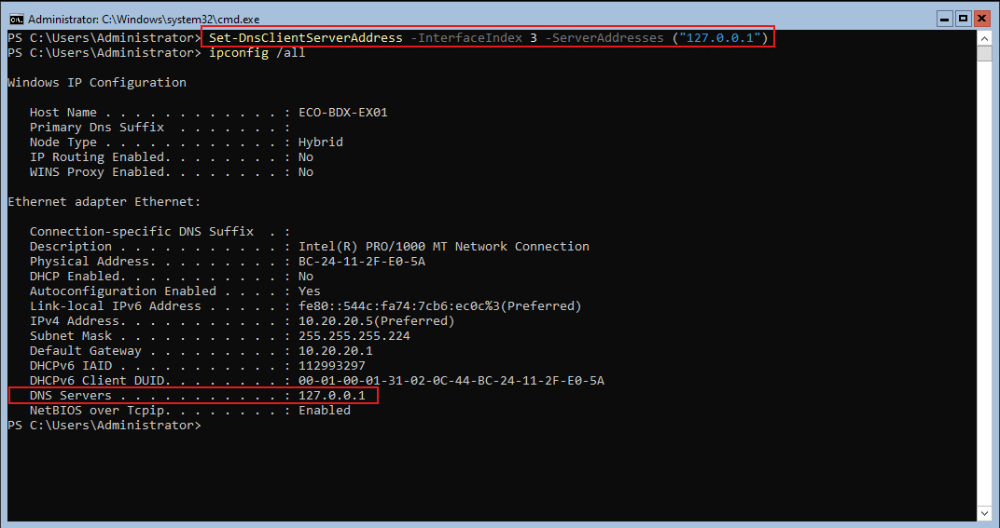

Installation du sereur DNS sur le serveur A

* Configuré sur `127.0.0.1` pour permettre la promotion du rôle AD DS.

Configurer le DNS sur le serveur avec la commande`Set-DnsClientServerAddress -InterfaceIndex 3 -ServerAddresses ("127.0.0.1")`.  
Vérifier via la commande `ipconfig /all` que la configuration du DNS est bien appliquée.

