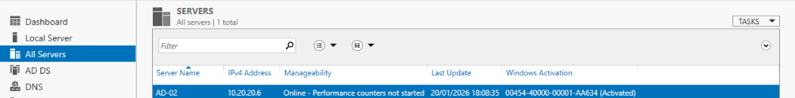
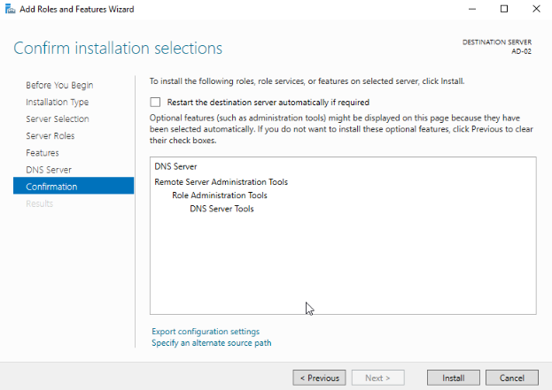

# Installation du sereur DNS sur les Contrôleurs du Domaine.

## Table des matieres :

- [1. Installation du DNS sur ECO-BDX-EX01](#installation-DNS-EX01)
- [2. Installation du DNS sur ECO-BDX-EX02](#installation-DNS-EX02)

Ce document retrace les étapes techniques de l'installation du rôle du DNS sur le serveur ECO-BDX-EX01 et ECO-BDX-EX02, premier et second contrôleur de domaine de l'infrastructure EcoTech Solutions.
Les captures d'écran présentes dans le document permettent d'améliorer la compréhension de l'installation du serveur.

## 1. Installation du DNS sur ECO-BDX-EX01. (Core)

La configuration du DNS se fait avec l'adresse `172.0.0.1` car il a le rôle principale et l'adresse `10.20.20.6` correspond au serveur AD secondaire :

- Configurer le DNS sur le serveur avec la commande`Set-DnsClientServerAddress -InterfaceIndex 3 -ServerAddresses ("127.0.0.1, 10.20.20.5")`.
- Vérifier via la commande `ipconfig /all` que la configuration du DNS est bien appliquée.

## 2. Installation du DNS sur ECO-BDX-EX02. (GUI)

Contrairement à la version Core, l'installation s'effectue via l'ajout du rôle DNS via server manager.

Ajout du rôle DNS

Ensuite selectionner le serveur 

Selectionner le rôle à ajouter en cochant la case, ici le DNS

Installation du rôle

Une fois l'installation terminée le rôle DNS s'affiche dans la liste à gauche sur server manager
